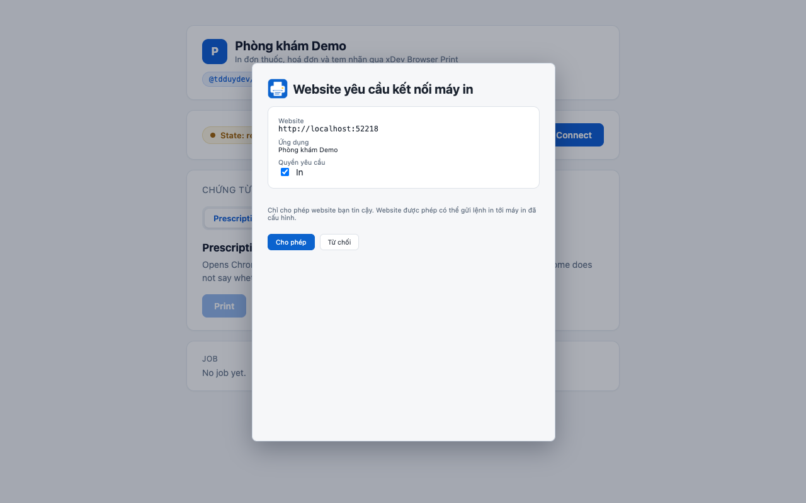
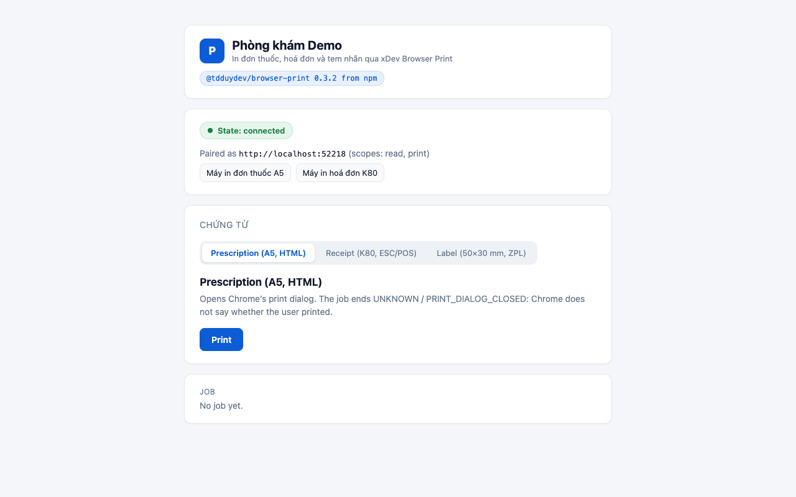
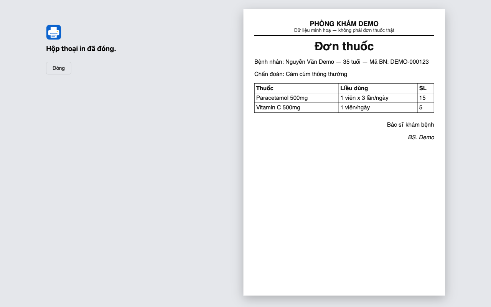
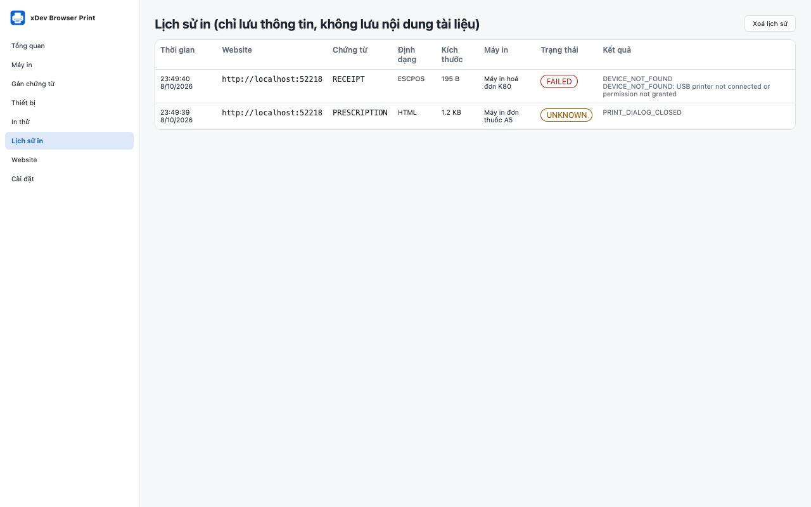

# xDev Browser Print

[](https://github.com/tdduydev/xdev-browser-print/actions/workflows/ci.yml)
[](https://www.npmjs.com/package/@tdduydev/browser-print)
[](LICENSE)

A Chrome Extension (Manifest V3) and TypeScript SDK that let ReactJS web apps print prescriptions, invoices and labels to printers configured per document type. No backend, native app or cloud print service.

SDK on npm: [`@tdduydev/browser-print`](https://www.npmjs.com/package/@tdduydev/browser-print)

```bash
npm install @tdduydev/browser-print
```

Tiếng Việt: [docs/vi](docs/vi/ARCHITECTURE.md)

## Showcase

A React app connects to the extension, the user approves the print scope once, and an A5 prescription goes to Chrome's print dialog.


*The extension asks before a site may print; the grant is for that exact origin.*


*Connected: the app sees the granted scopes and the printer profiles.*


*The A5 prescription the extension renders for the print dialog (sanitized, sandboxed frame).*


*Job history keeps metadata only: the prescription ends `UNKNOWN / PRINT_DIALOG_CLOSED`, the K80 receipt with no USB printer attached fails `DEVICE_NOT_FOUND`.*

Verified: these screenshots come from an automated run (`SHOWCASE_OUT=docs/images/showcase pnpm showcase <app-dist>`, [scripts/showcase.mjs](scripts/showcase.mjs)) of a Vite + React app with `@tdduydev/browser-print@0.3.2` installed from npm, against the extension e2e build, on 2026-10-08. Demo data only (fake clinic and patient). All screenshots: [docs/images/showcase](docs/images/showcase).

| Path | Contents |
|---|---|
| `apps/extension` | Extension: service worker, content script, admin UI, print window |
| `packages/browser-print-sdk` | SDK `@tdduydev/browser-print` and the `useBrowserPrint` hook |
| `packages/core` | Shared logic: origins, configuration, router, job states, encoders |
| `packages/shared-types` | Types and protocol |
| `examples/react-demo` | Vite + React example app using `useBrowserPrint` ([README](examples/react-demo/README.md)) |
| `tests/e2e` | Playwright e2e on real Chromium |
| `docs` | Design documents |

## Commands

```bash
pnpm install
pnpm lint && pnpm typecheck
pnpm test          # unit + integration
pnpm test:e2e      # e2e (first time: pnpm exec playwright install chromium)
pnpm build         # apps/extension/dist + packages/browser-print-sdk/dist
pnpm check:sdk-package # npm pack --dry-run + SDK checks (after build)
pnpm package       # release/xdev-browser-print-<version>.zip
pnpm cws:screenshots  # Chrome Web Store screenshots -> docs/images/cws (1280x800)
pnpm showcase [app-dist] # end-to-end check of a built app + extension -> test-results/showcase (1280x800)
```

Install the extension: [Chrome Web Store](https://xdev.asia/browser-print/) (in review) or the release build — [download the latest ZIP](https://github.com/tdduydev/xdev-browser-print/releases/latest/download/xdev-browser-print.zip) and follow [docs/INSTALL.md](docs/INSTALL.md) ([Tiếng Việt](docs/vi/INSTALL.md)).

From source: open `chrome://extensions`, enable Developer mode, click **Load unpacked** → `apps/extension/dist`.

## CI/CD

| Workflow | Trigger | Does |
|---|---|---|
| `ci.yml` | Push to `main`, pull requests | Lint, typecheck; unit tests on Ubuntu/Windows/macOS; build + release ZIP artifact; Playwright e2e |
| `release-please.yml` | Push to `main` | When the push has releasable commits (`feat:` → minor, `fix:` → patch while below 1.0), opens the Release PR (version in root, extension and SDK `package.json`, CHANGELOG), **merges it automatically**, tags `vX.Y.Z` and calls `release.yml` |
| `release.yml` | Called by release-please, or a hand-pushed tag `v*.*.*` | Checks SDK/extension/tag versions, builds and verifies the SDK tarball, creates a GitHub Release, then publishes the SDK to npm through the `npm` environment with trusted publishing (no token) and uploads to the Chrome Web Store |

Chrome Web Store upload (API V2) runs only when the `chrome-web-store` environment has the variables `GCP_WIF_PROVIDER`, `CWS_SERVICE_ACCOUNT`, `CWS_PUBLISHER_ID`, `CWS_EXTENSION_ID`. CI signs in through Workload Identity Federation as the `cws-publisher` service account, so no secret is stored; that service account must be added in the Chrome Web Store Developer Dashboard. A successful upload means the item was **submitted for review**, not published.

Releasing is therefore automatic: merge a PR with a `feat:` or `fix:` title into `main` → a new version is tagged and built → approve the `npm` and `chrome-web-store` deployments in the Actions run. `docs:`, `test:`, `ci:` and `chore:` commits wait for the next release. Commits that are not conventional (`ai(T4): …`, merge commits) do not appear in the CHANGELOG. `release.yml` runs the full test suite before publishing.

SDK publication (`@tdduydev/browser-print`, MIT): [EN](docs/SDK-RELEASE.md) / [VI](docs/vi/SDK-RELEASE.md).

## Documents

- [Feature design](docs/ARCHITECTURE.md)
- [SDK API](docs/API.md)
- [Security](docs/SECURITY.md)
- [Testing](docs/TESTING.md)
- [Compatibility matrix](docs/COMPATIBILITY.md)
- [Phase 2 design and task plan](docs/PHASE-2.md)
- [Chrome Web Store submission](docs/CHROME_WEB_STORE.md)
- [Privacy policy](docs/PRIVACY.md)

## Key limitations

- Chrome on Windows/macOS/Linux does not let extensions list or select OS printers. PDF/HTML always go through the print dialog.
- Chrome does not report whether the user printed or cancelled. PDF/HTML jobs end in `UNKNOWN` + `PRINT_DIALOG_CLOSED`.
- Dialog-free printing exists only for printers that accept RAW commands over WebUSB/Web Serial, or when an administrator starts Chrome with `--kiosk-printing`.
