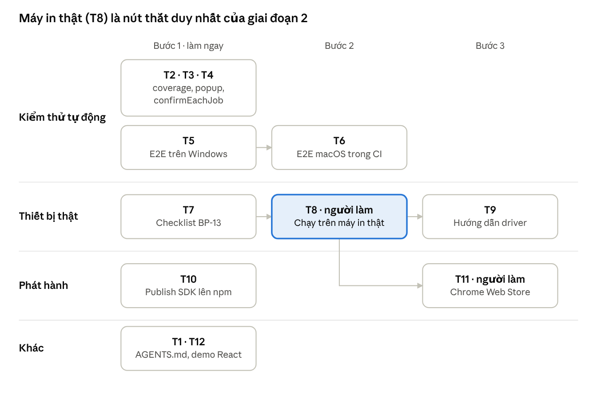

# Thiết kế giai đoạn 2 — xDev Browser Print

English version: [../PHASE-2.md](../PHASE-2.md)

Cập nhật: 2026-10-08.

## Bối cảnh và mục tiêu

Giai đoạn 2 đưa xDev Browser Print từ "Implemented" lên "Verified": tăng kiểm thử tự động, xác nhận trên máy in thật, rồi phát hành SDK và extension.

Hiện trạng v0.1.0 (sau PR #2):

- Extension MV3, SDK `@xdev/browser-print`, `packages/core`, `packages/shared-types` đã có, lint/typecheck/unit test xanh trên Ubuntu, Windows, macOS.
- E2E Playwright chỉ chạy trên Linux (CI) và macOS (máy local). Windows chưa có e2e.
- Chưa có thiết bị nào đạt mức "Verified on Physical Printer" (`docs/COMPATIBILITY.md`).
- `docs/TESTING.md` mục 5 liệt kê các khoảng trống: popup, `confirmEachJob`, coverage (BP-10), Windows e2e (BP-12), hộp thoại in thật, `--kiosk-printing`, WebUSB/Serial thật, prompt quyền thật (BP-13).
- `release.yml` tạo GitHub Release và tùy chọn gửi lên Chrome Web Store, nhưng chưa publish SDK lên npm.

Mục tiêu giai đoạn 2:

1. Mọi khoảng trống tự động hóa được trong TESTING.md mục 5 đều có test chạy trong CI.
2. Ít nhất một máy in nhiệt (K80) và một luồng hộp thoại in A5 đạt "Verified on Physical Printer".
3. Có một bản phát hành v0.2.0: SDK trên npm và extension đã gửi review Chrome Web Store.

## Phạm vi

Giai đoạn 2 không thêm tính năng in mới; nó kiểm chứng và phát hành những gì v0.1.0 đã có.

| Trong phạm vi | Ngoài phạm vi |
| --- | --- |
| Test tự động cho popup, `confirmEachJob`, coverage, e2e Windows/macOS | Định dạng in mới, adapter mới (Bluetooth, mạng LAN) |
| Checklist và biên bản kiểm thử trên máy in thật | Tự động hóa hộp thoại in của Chrome (Chrome không cho phép) |
| Hướng dẫn driver WinUSB, udev | Trình duyệt ngoài Chrome/Chromium (Edge chỉ ghi nhận nếu chạy được) |
| Publish SDK lên npm, nộp Chrome Web Store | Native app, backend, cloud print |
| Example app React, tài liệu repo cho agent | Thay đổi giao thức SDK ↔ extension |

## Kiểm thử tự động (T2–T6)

Nhóm này dùng lại fixture Playwright hiện có (`tests/e2e/fixtures.ts`: Chromium persistent context, build `dist-e2e` có sẵn quyền `http://localhost/*`) và không đổi code extension, trừ khi test lộ ra lỗi.

### T2 — Coverage

- Thêm `@vitest/coverage-v8`, cấu hình `coverage` trong vitest config: `include` là `packages/*/src` và `apps/extension/src`, bỏ qua `*.tsx` của UI (đã có e2e).
- Script `pnpm test:coverage`; job unit trên Ubuntu chạy nó và upload thư mục `coverage/` làm artifact.
- Ngưỡng: đo lần đầu, đặt `thresholds` bằng mức đo được làm tròn xuống 5 điểm. Mục đích là chặn tụt, không ép con số.

### T3 — E2E popup

- Mở `chrome-extension://<id>/popup.html` trong tab thường. Popup cần biết tab đang hoạt động, nên test mở trang site trước rồi mở popup với tham số tab, hoặc stub `chrome.tabs.query` qua `page.addInitScript` nếu popup không nhận tham số.
- Ca cần có: trang `http://localhost` chưa ghép nối → hiện nút ghép nối; trang đã ghép nối → hiện scope và nút thu hồi; trang `chrome://` hoặc `http://` không phải localhost → thông báo `popup.unsupportedPage`.
- Thêm ID ca vào `docs/TESTING.md` (và bản `docs/vi`).

### T4 — E2E `confirmEachJob`

- `confirmEachJob` là cờ trên từng site grant (`apps/extension/src/background/sites.ts`). Test bật cờ qua trang Sites của admin UI, không ghi thẳng vào storage.
- Ca cần có: gửi job → cửa sổ phê duyệt mở → duyệt → job đi tiếp; từ chối → SDK nhận lỗi đúng mã; đóng cửa sổ không trả lời → job kết thúc theo quy định trong `docs/ARCHITECTURE.md`.
- Kiểm tra thêm: khi service worker bị dừng lúc cửa sổ phê duyệt đang mở, job không bị in hai lần.

### T5 — E2E trên Windows

- Chuyển job `e2e` trong `ci.yml` sang matrix `os: [ubuntu-latest, windows-latest]`.
- Rủi ro đã thấy: script `build:e2e` dùng cú pháp `XDBP_E2E=1 vite build`, không chạy trên shell mặc định của pnpm trên Windows. Sửa bằng `cross-env` hoặc đọc biến qua `--mode e2e` của Vite.
- Kiểm tra đường dẫn trong `fixtures.ts`: `normalize` + `startsWith(dir)` phải đúng với dấu `\\` trên Windows.
- Cập nhật cột Windows trong `docs/COMPATIBILITY.md` khi CI xanh, ghi số run.

### T6 — E2E trên macOS trong CI

- Thêm `macos-latest` vào matrix của T5. Nếu thời gian chạy hoặc chi phí runner macOS quá cao, chỉ chạy trên push vào `main` và trên tag, không chạy trên mọi PR.

## Thiết bị thật (T7–T9)

Một thiết bị chỉ được nâng lên "Verified on Physical Printer" khi có biên bản theo checklist T7, kèm ảnh giấy in ra.

### T7 — Checklist BP-13

Tạo `docs/MANUAL-TEST.md` và `docs/vi/MANUAL-TEST.md`. Mỗi ca có ID, điều kiện, các bước, kết quả mong đợi. Các nhóm ca:

| Nhóm | Ví dụ ca | Thiết bị cần |
| --- | --- | --- |
| Hộp thoại in | Đơn thuốc A5 HTML, hóa đơn PDF A4: khổ giấy, lề, số trang đúng; job kết thúc `UNKNOWN` + `PRINT_DIALOG_CLOSED` | Máy in văn phòng bất kỳ |
| `--kiosk-printing` | Chrome chạy với cờ này in thẳng ra máy in mặc định, không hiện hộp thoại | Máy Windows + máy in mặc định |
| WebUSB ESC/POS | Ghép thiết bị, in hóa đơn K80 và K58, cắt giấy, tiếng Việt có dấu đúng bảng mã | Máy in nhiệt K80/K58 USB |
| WebUSB ZPL/TSPL | In tem 50×30 mm, mã vạch quét được | Máy in tem |
| Web Serial | Các ca trên qua cổng COM/serial | Máy in có cổng serial hoặc USB-serial |
| Lỗi thiết bị | Rút cáp khi đang in, hết giấy, thiết bị bị driver hệ điều hành chiếm (`DEVICE_BUSY`) | Như trên |
| Quyền thật | Prompt `chrome.permissions.request` khi ghép nối site https thật | Không cần máy in |

Cuối file có mẫu biên bản: ngày, người test, OS và bản Chrome, model máy in, firmware/driver, kết quả từng ca, ảnh. `docs/COMPATIBILITY.md` thêm bảng "Verified devices" để dán kết quả.

### T8 — Chạy BP-13 trên máy in thật

- Người có thiết bị chạy checklist T7 trên ít nhất Windows 11 và một OS khác.
- Mỗi lỗi tìm thấy thành một task riêng trên Hive, liên kết về T8; T8 không tự sửa code.
- Kết quả và ảnh được cập nhật vào `docs/COMPATIBILITY.md` qua PR.

### T9 — Hướng dẫn driver và quyền thiết bị

- `docs/DEVICE-SETUP.md` (+ bản vi): Windows — cài WinUSB bằng Zadig, nói rõ máy in sẽ không in qua driver Windows nữa và cách gỡ; Linux — udev rule theo `idVendor`/`idProduct`, unbind `usblp`; macOS — ghi lại những gì T8 thấy.
- Kèm `scripts/udev/99-xdev-printer.rules` mẫu.
- Admin UI (trang Devices) liên kết tới tài liệu này khi gặp `DEVICE_BUSY`.
- Chỉ viết các bước đã được T8 xác nhận; phần chưa thử thì ghi "chưa xác nhận".

## Phát hành (T10–T11)

Một tag `vX.Y.Z` phát hành cả extension và SDK cùng version; mọi bước đẩy ra ngoài đều qua một GitHub environment có người duyệt.

### T10 — Publish SDK lên npm

- `packages/browser-print-sdk/package.json` đang là `"license": "UNLICENSED"`. Cần chốt: publish công khai trên npmjs (đổi license, scope `@xdev` phải thuộc về team), hay publish riêng tư lên GitHub Packages.
- `release.yml`: thêm job `npm-publish` sau `release`, dùng environment `npm` chứa `NPM_TOKEN`; kiểm tra version SDK = version extension = tag; `npm publish --provenance --access <public|restricted>`.
- `packages/shared-types` được bundle vào SDK bởi tsup hay phải publish riêng: kiểm tra `dist/*.d.ts` không import `@xdev/shared-types`; nếu có thì bật `dts.resolve` hoặc publish cả gói đó.
- Thêm bước `npm pack --dry-run` vào CI để bắt lỗi đóng gói sớm.

### T11 — Chrome Web Store lần đầu

- Người quản trị tạo item trên Developer Dashboard (lần đầu phải upload tay), lấy `CWS_EXTENSION_ID`, tạo OAuth client và refresh token, thêm 4 secret vào environment `chrome-web-store`, bật required reviewers.
- Agent soạn: mô tả store (EN + vi), giải thích từng quyền (`storage`, `scripting`, `activeTab`, `optional_host_permissions`, WebUSB, Web Serial), privacy policy (dữ liệu in không rời máy), ảnh chụp màn hình từ admin UI.
- Quyết định visibility: Unlisted (chỉ khách hàng có link) hay Public. Mặc định đề xuất Unlisted cho v0.2.0.
- Xong khi item ở trạng thái "Pending review"; duyệt xong là việc của Google, không chặn task.

## Example app và tài liệu repo (T12, T1)

### T12 — Example app React

- `examples/react-demo`: Vite + React, dùng `@xdev/browser-print/react` (`useBrowserPrint`) qua `workspace:*`.
- Ba màn hình ứng với ba loại tài liệu: đơn thuốc A5 (HTML → hộp thoại in), hóa đơn K80 (ESC/POS), tem 50×30 mm (ZPL). Mỗi màn hình hiện trạng thái job và mã lỗi SDK trả về.
- Hiện trang test e2e là `tests/e2e/site/index.html` tự viết. Giữ nguyên trang đó trong giai đoạn này; chỉ thêm một smoke test e2e cho demo (build được, ghép nối được, gửi một job HTML).
- Demo dùng làm tài liệu tích hợp cho khách hàng: README của demo dẫn tới `docs/API.md`.

### T1 — Tài liệu repo cho agent

- Phần cuối `AGENTS.md` vẫn là placeholder "Mô tả ngắn dự án…". Theo quy tắc Hive, không sửa trực tiếp: `doc_get` rồi `doc_propose` với `baseVersion`.
- Nội dung: mô tả một đoạn; lệnh `pnpm lint`, `typecheck`, `test`, `test:e2e`, `build`, `package`; cấu trúc `apps/` và `packages/`; quy ước: tài liệu luôn có bản EN + `docs/vi`, không nâng mức trong COMPATIBILITY.md chỉ dựa vào mock, build e2e là `dist-e2e` và có sẵn quyền localhost.
- Ghi các gotcha vào Hive bằng `memory_write` (ví dụ: job PDF/HTML luôn kết thúc `UNKNOWN`).

## Thứ tự, phụ thuộc và rủi ro

Tám task không phụ thuộc gì và có thể giao song song ngay; T8 cần người có máy in và chặn T9, T11.

| Rủi ro | Ảnh hưởng | Cách xử lý |
| --- | --- | --- |
| Không có người hoặc thiết bị cho T8 | T9, T11 và mục tiêu 2 bị chặn | Chốt người và danh sách model máy in ngay khi giao T7 |
| WinUSB làm máy in mất driver Windows | Khách hàng không in được từ ứng dụng khác | T9 nói rõ đánh đổi và cách gỡ; cân nhắc Web Serial hoặc hộp thoại in cho máy dùng chung |
| E2E Windows/macOS chập chờn (service worker khởi động chậm) | CI đỏ giả, người review bỏ qua | Đánh dấu test chập chờn, không tăng `retries` quá 1 |
| Chi phí runner macOS | Tốn phút CI | T6 chỉ chạy trên `main` và tag |
| `@xdev/shared-types` chưa publish nhưng SDK import nó | Gói npm hỏng kiểu TypeScript phía khách | T10 kiểm tra `dist/*.d.ts` và chạy `npm pack --dry-run` |
| Chrome Web Store từ chối vì quyền rộng (`https://*/*`) | Trễ phát hành | Quyền đã là `optional_host_permissions`; T11 giải thích từng quyền trong form nộp |

Mọi task ở cột Bước 1 giao được ngay; T8 là việc của người có máy in và mở khóa T9, T11.

## Thẻ task để nhập lên Hive

Mỗi dòng là một task. Mô tả trên Hive ghi "Thiết kế: mục `T<n>` trong `docs/vi/PHASE-2.md`" kèm cột mô tả dưới đây. Phụ thuộc đặt bằng `dependsOn` khi tạo.

| ID | Tiêu đề | Mô tả | Loại | Phụ thuộc | Tiêu chí xong |
| --- | --- | --- | --- | --- | --- |
| T1 | Hoàn thiện AGENTS.md cho repo | Thay placeholder bằng mô tả, lệnh, cấu trúc, quy ước; gửi qua `doc_propose` | AI | — | Đề xuất được duyệt trên Hive |
| T2 | Đo coverage trong CI (BP-10a) | `@vitest/coverage-v8`, `pnpm test:coverage`, artifact, ngưỡng theo mức hiện tại | AI | — | CI có artifact coverage, ngưỡng được kiểm tra |
| T3 | E2E cho popup (BP-10b) | Ca chưa ghép nối, đã ghép nối + thu hồi, trang không hỗ trợ | AI | — | Test mới xanh trên CI, TESTING.md cập nhật |
| T4 | E2E cho `confirmEachJob` (BP-10c) | Duyệt, từ chối, đóng cửa sổ, dừng service worker | AI | — | Test mới xanh trên CI, TESTING.md cập nhật |
| T5 | E2E trên Windows (BP-12) | Matrix e2e, sửa `build:e2e` bằng `cross-env`, kiểm tra đường dẫn | AI | — | E2E Windows xanh, COMPATIBILITY.md ghi số run |
| T6 | E2E trên macOS trong CI | Thêm `macos-latest` vào matrix, có thể chỉ chạy trên `main` và tag | AI | T5 | E2E macOS xanh trong CI |
| T7 | Checklist kiểm thử thủ công BP-13 | `docs/MANUAL-TEST.md` (EN + vi), mẫu biên bản, bảng Verified devices | AI | — | Tài liệu được merge |
| T8 | Chạy BP-13 trên máy in thật | K80/K58, máy in tem, hộp thoại in A4/A5; mỗi lỗi là một task mới | Người | T7 | Ít nhất 1 thiết bị "Verified on Physical Printer" |
| T9 | Hướng dẫn driver và quyền thiết bị | `docs/DEVICE-SETUP.md` (EN + vi), udev rule mẫu, liên kết từ trang Devices | AI | T8 | Tài liệu merge, người làm T8 xác nhận |
| T10 | Publish SDK lên npm | Chốt registry và license, job `npm-publish` có provenance, kiểm tra `shared-types` được bundle | AI + Người | — | `npm pack --dry-run` xanh trong CI; tag thử publish được |
| T11 | Nộp Chrome Web Store lần đầu | Người tạo item và secret; agent soạn mô tả, giải thích quyền, privacy policy, ảnh | Người + AI | T8 | Item ở trạng thái Pending review |
| T12 | Example app React | `examples/react-demo` với đơn thuốc A5, hóa đơn K80, tem ZPL, smoke test e2e | AI | — | Chạy được, smoke test xanh, README có hướng dẫn |
